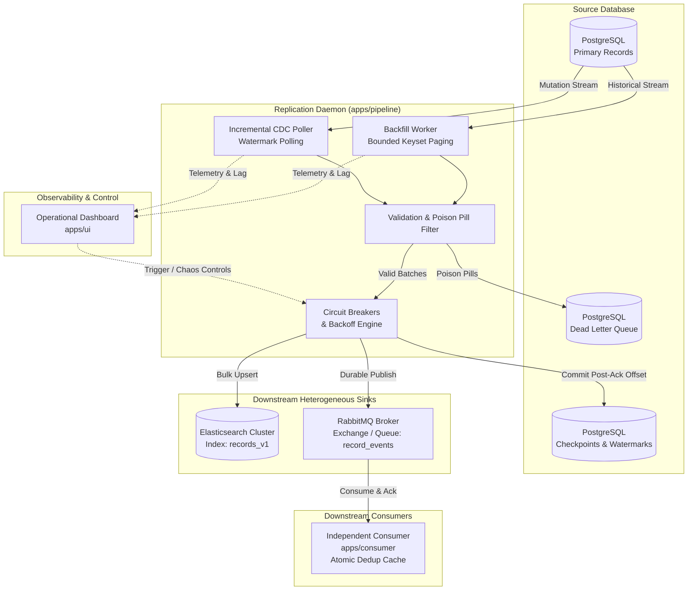

# System Specification: Kill It Twice Replication Platform (Version 1.0 - Draft & Baseline)

- **Document Version**: 1.0 (Baseline Specification)
- **Author**: Platform Engineering & Core Architecture Team
- **Date**: September 2026
- **Status**: Active / In Development
- **Repository**: `Giorgi2201/optio_test`

---

## 1. System Mission & Core Requirements

The **Kill It Twice Replication Platform** is an enterprise-grade, fault-tolerant dual-sink synchronization engine engineered to replicate high-volume transactional data from **PostgreSQL** concurrently into two independent downstream destinations:

1. **Sink 1: Elasticsearch**: Analytical document search index storing current state with deterministic document IDs, powering real-time search queries and aggregations.
2. **Sink 2: RabbitMQ**: Durable, decoupled message bus delivering change events to an independent background consumer service (`apps/consumer`) simulating downstream business event processing.



### 1.1 Dual-Mode Concurrent Execution
- **Bulk Historical Backfill**: Streams initial cold or historical state sequentially via bounded keyset pagination without table locking or degrading active OLTP workloads.
- **Incremental CDC / Polling Engine**: Concurrently tracks live inserts, updates, and deletes (`updated_at` / transaction sequencing) with low latency (< 1,000 ms replication lag).
- **Concurrency Invariant**: Backfill streaming and incremental synchronization must run concurrently without resource contention, deadlocks, or cross-mode state corruption.

### 1.2 Observability & Operator Control
- **Operational Dashboard (`apps/ui`)**: Provides real-time visibility into replication throughput (records/sec), watermark progress, incremental replication lag, sink circuit breaker health states, and Dead Letter Queue (DLQ) depth.
- **Interactive Operator Actions**: Manual trigger controls for full/partial backfills, DLQ inspection, payload remediation, and chaos injection triggers.

---

## 2. Data Volume Strategy & Non-Trivial Sizing Rationale

### 2.1 Baseline Dataset Scale
The system is explicitly validated against a realistic synthetic baseline:
- **Test Dataset Size**: **500,000 to 2,000,000 records** (averaging 500 bytes to 1 KB per record payload, generating 250 MB to 2 GB of raw relational data).

### 2.2 Rejection of Trivial In-Memory Extraction
In typical non-production or naive replication prototypes, engineers often use simple `SELECT * FROM source_table` queries and buffer arrays in memory. In Node.js:
- Default V8 heap allocation is capped at approximately **1.4 GB** (unless specifically expanded with `--max-old-space-size`).
- In-memory deserialization of 1,000,000 complex database rows generates object graphs exceeding 3.5 GB of heap space, guaranteeing process crashes via `FATAL ERROR: Ineffective mark-compacts near heap limit Allocation failed - JavaScript heap out of memory`.

### 2.3 Strict O(1) Memory Streaming Contract
To guarantee deterministic O(1) heap memory consumption regardless of whether the source table holds 10,000 or 100,000,000 records:
1. **Keyset Pagination (Seek Method)**: All historical backfill extraction queries strictly utilize monotonic indexed keyset paging:
   ```sql
   SELECT id, payload, created_at, updated_at
   FROM source_records
   WHERE id > :last_committed_id
   ORDER BY id ASC
   LIMIT :batch_size;
   ```
2. **Bounded Batch Windows**: Batch chunk sizes are bounded strictly between **500 and 2,000 records** per processing iteration.
3. **Backpressure Propagation**: A subsequent batch must never be pulled from PostgreSQL until the current in-flight batch has completed dual-sink dispatch and received persistent checkpoint confirmation.

---

## 3. The Five Resilience Gates (Contract & Success Criteria)

The core evaluation of this platform is governed by five automated, non-negotiable resilience gates:

| Gate | Name | Resilience Contract & Evaluation Criteria |
| :--- | :--- | :--- |
| **Gate 1** | **Crash Recovery** | Process termination (`SIGKILL`, `docker kill -9`, container halt) injected mid-backfill. Upon process restart, the pipeline must immediately recover the last persisted watermark from Postgres and resume streaming. The pipeline must **NEVER restart from ID 0** or lose intermediate progress. |
| **Gate 2** | **Deduplication & Effectively-Once Delivery** | Delivers an **Effectively-Once** contract via At-Least-Once replay combined with deterministic idempotent upserts. After repeated crashes, restarts, and re-deliveries, the final document count in Elasticsearch and acknowledged count in RabbitMQ consumer must match PostgreSQL source count 1:1 with **zero duplicate side effects**. |
| **Gate 3** | **Downstream Receiver Outage** | When Elasticsearch or RabbitMQ is forcibly disconnected or paused for 60+ seconds: the pipeline must trip a 3-state Circuit Breaker (`OPEN`), pause extraction, apply exponential backoff with full jitter, avoid CPU busy-loop spinning, and automatically resume (`HALF-OPEN` -> `CLOSED`) upon sink recovery without human intervention. |
| **Gate 4** | **Partial Batch Failure & DLQ** | If a batch of 500 records contains 3 corrupted/malformed payloads (poison pills rejected by sink mapping or validation): the pipeline must commit the 497 valid records to the sinks, isolate the 3 failed records into a transactional **Dead Letter Queue (DLQ)** with diagnostic metadata, and preserve pipeline throughput without failing or rolling back the valid records. |
| **Gate 5** | **Observability & Introspection** | The operational state of the pipeline must be fully inspectable externally via real-time metrics and UI dashboards without reading process log files or inspecting application code. Must expose backfill %, throughput (records/sec), replication lag, circuit breaker states, and DLQ depth. |

---

## 4. Single-Command Verification Contract (`make verify`)

All five resilience gates are codified into an authoritative, fully automated verification harness executable with a single command:

```bash
make verify
# or equivalently:
bash scripts/verify.sh
```

### 4.1 Automated Chaos Injection Workflow
The verification harness executes an end-to-end integration scenario:
1. **Spins up clean-slate infrastructure** (PostgreSQL, Elasticsearch, RabbitMQ) via Docker Compose.
2. **Seeds 500,000+ transactional records** using the deterministic synthetic data seeder (`scripts/seed.sh`).
3. **Starts the replication pipeline daemon** in background backfill mode.
4. **Injects SIGKILL chaos**: Arbitrarily kills the replication daemon process halfway through backfill, restarts it, and confirms resumption from watermark (Gate 1).
5. **Injects Sink Outage chaos**: Disconnects Elasticsearch and RabbitMQ for 60 seconds, verifying backoff behavior and zero busy-spin CPU burn, then restores connectivity and confirms recovery (Gate 3).
6. **Injects Poison Pill payloads**: Inserts malformed records into the stream, verifying DLQ capture and valid record completion (Gate 4).
7. **Verifies Telemetry**: Asserts operational health and metrics endpoints respond with accurate telemetry (Gate 5).
8. **Asserts Final Counts & Deduplication**: Reconciles source table rows against Elasticsearch index count and RabbitMQ consumer receipt count (Gate 2).

### 4.2 Standard Output Format
Upon completion, the harness emits the standardized gate summary report:
```text
======================================================================
              OPTIO SYSTEM VERIFICATION REPORT (v1.0)
======================================================================
G1 resume after kill ............ PASS
G2 no duplicates ................ PASS
G3 sink outage .................. PASS
G4 partial batch failure ........ PASS
G5 observability ................ PASS
======================================================================
ALL RESILIENCE GATES PASSED [5/5]
```

---

## 5. Architectural Decisions Already Locked (v1 Baseline)

1. **PostgreSQL as Single Source of Truth**:
   - Source business records are persisted in PostgreSQL.
   - Persistent monotonic watermarks and pipeline checkpoints are stored transactionally in PostgreSQL (`replication_checkpoints` table).
   - The Dead Letter Queue (DLQ) is persisted in PostgreSQL (`replication_dlq` table) for ACID durability and operator remediation.

2. **Dedicated Independent Consumer Microservice (`apps/consumer`)**:
   - To truly validate RabbitMQ event stream delivery, an independent Node.js worker service runs out-of-process, binds to the AMQP queue, validates message schemas, and records consumption acknowledgments into a deduplication tracking store.

3. **Strict Post-Sink-ACK Atomic Commit**:
   - A checkpoint watermark is committed to Postgres **only and strictly after** both Elasticsearch has responded with HTTP 200/201 bulk acknowledgment AND RabbitMQ broker has confirmed AMQP publisher acknowledgment.
   - Speculative checkpointing is strictly prohibited.

4. **Deterministic Idempotency Mapping**:
   - Elasticsearch document ID: `_id = source_records.id`. Upsert semantics use `doc_as_upsert: true` with sequential versioning.
   - RabbitMQ message ID: `message_id = ${source_records.id}:${source_records.updated_at.getTime()}`.

---

## 6. Open Architectural Questions & High-Risk Dilemmas (v1 Baseline)

During implementation, the following architectural challenges must be actively investigated, benchmarked, and resolved:

### Dilemma 1: Dual-Mode Race Conditions (Backfill vs. Incremental Poller)
- *The Problem*: When the initial historical backfill and incremental CDC poller execute concurrently, a slow backfill chunk reading an older snapshot of Record #42 could overwrite an update to Record #42 that was already processed milliseconds earlier by the fast incremental poller.
- *Potential Approaches*:
  - **Approach A (Elasticsearch External Versioning)**: Use PostgreSQL `updated_at` epoch timestamp or monotonic sequence number as Elasticsearch `version` (`version_type=external_gte`). Any older backfill write arriving late is automatically rejected by Elasticsearch with HTTP 409 (Conflict).
  - **Approach B (Keyset Watermark Partitioning)**: Prevent incremental poller from querying records with IDs that have not yet been crossed by the backfill watermark.
  - *Decision Target*: Validate Approach A during prototype stage for lower locking overhead.

### Dilemma 2: RabbitMQ Consumer-Side Deduplication & Restart Invariants
- *The Problem*: RabbitMQ guarantees at-least-once delivery. If the replication pipeline crashes after publishing to RabbitMQ but before persisting the checkpoint to Postgres, the batch will be re-published upon restart. If the consumer service also crashes before acknowledging RabbitMQ messages, un-ACKed messages will be re-queued.
- *Potential Approaches*:
  - **Approach A (In-Memory LRU with TTL Cache)**: High-speed deduplication window tracking recently processed `message_id`s in consumer memory. Risk: Worker restart wipes memory.
  - **Approach B (Atomic Redis / Postgres Dedup Store)**: Consumer records processed message IDs into a persistent deduplication key-value table within an atomic transaction.
  - *Decision Target*: Implement persistent deduplication store to withstand consumer restarts.

### Dilemma 3: Host Environment Resilience & Windows / Docker Divergence
- *The Problem*: Host systems running Windows with Docker Desktop occasionally exhibit daemon socket freezes, volume latency, or port binding anomalies during aggressive chaos scripts (e.g. repeated container kills).
- *Potential Approaches*:
  - Provide a hybrid execution architecture: `scripts/verify.sh` will primarily run inside production Docker Compose, but also provide native local process fallback orchestration (via Node.js process managers) pointing to containerized dependencies.

---

*This specification represents the formal contract for the v1.0 baseline of the OPTIO platform.*
