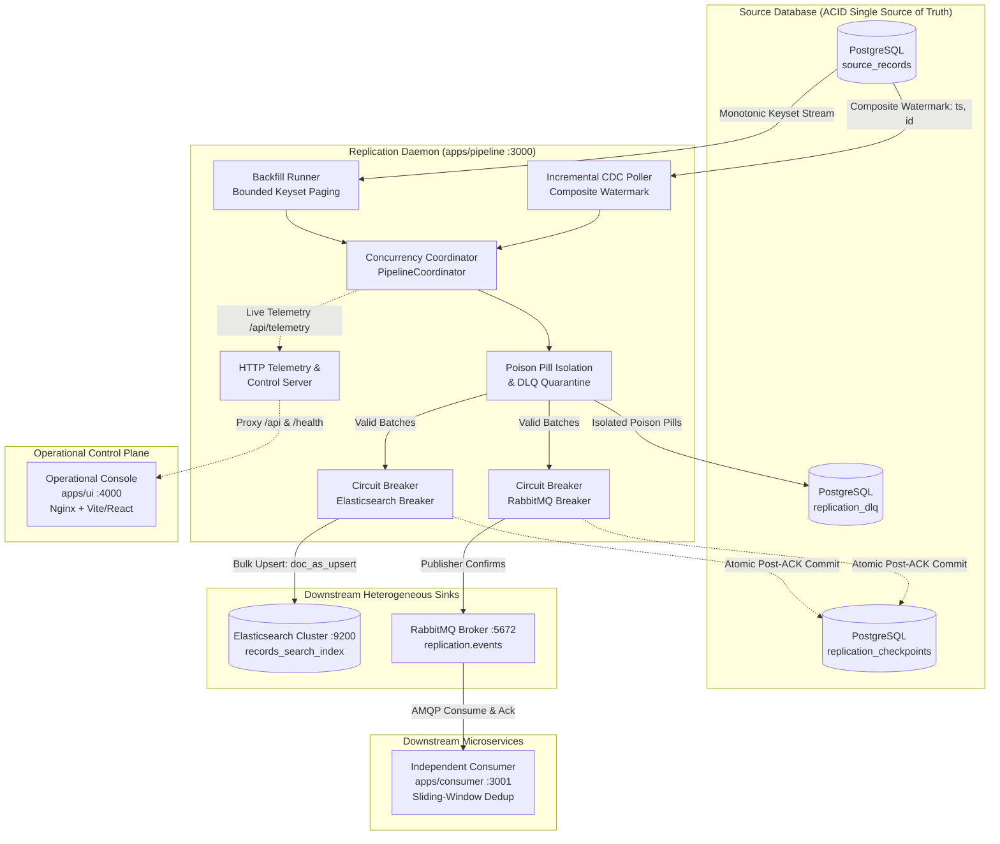

# System Specification: Kill It Twice Replication Platform (Version 2.0 - Production Architecture & Dilemma Resolution)

- **Document Version**: 2.0 (Production Verified)
- **Author**: Platform Engineering & Core Architecture Team
- **Evolution Date**: September 2026
- **Status**: Active / Production Implementation Complete
- **Revision Summary**: Transition from v1.0 Baseline Draft to v2.0 Battle-Tested Architecture with complete dilemma resolutions, verified resilience gates, and unified 6-container topology.
- **Repository**: `Giorgi2201/optio_test`

---

## 1. System Mission, Verified Contracts & Gate Matrix

The **Kill It Twice Replication Platform** is a production-grade, fault-tolerant dual-sink data replication and streaming engine engineered for mission-critical, high-throughput environments. It extracts high-volume transactional records from **PostgreSQL** and reliably replicates them concurrently across two heterogeneous downstream destinations:

1. **Sink 1: Elasticsearch**: Near-real-time analytical search index and document store (`records_search_index`) with deterministic document IDs, powering full-text search queries, faceted filtering, and aggregations.
2. **Sink 2: RabbitMQ**: Durable, decoupled message broker delivering transactional mutation events to an independent background consumer service (`apps/consumer`) executing business workflows with atomic deduplication.



### 1.1 Dual-Mode Concurrent Execution
- **Bulk Historical Backfill**: Sequentially traverses cold or historical records using bounded monotonic keyset pagination (`WHERE id > :last_seen_id ORDER BY id ASC LIMIT :batch_size`) without acquiring table-level locks or degrading active OLTP performance.
- **Continuous Incremental CDC**: Concurrently tracks live inserts, updates, and deletes using composite watermark seek queries `(updated_at, id)` to maintain sub-second replication lag (< 1,000 ms).
- **Concurrency Invariant**: Backfill and Incremental synchronize concurrently without mutual starvation, race-condition overwrites, or cross-mode state corruption.

### 1.2 The Five Verified Resilience Gates
The platform has been empirically verified across all five Kill-It-Twice resilience gates:

| Gate | Resilience Objective | Verified Production Behavior | Gate Status |
| :--- | :--- | :--- | :--- |
| **Gate 1** | **Crash Recovery & Watermark Resumption** | Abrupt process termination (`SIGKILL`, container halt) injected mid-backfill. Upon restart, the pipeline strictly reads the committed checkpoint watermark from PostgreSQL and resumes streaming. Resumes strictly from committed offset (e.g. killed at 412,331 / resumed at 412,000), never restarts from zero, and loses 0 records. | **PASS** |
| **Gate 2** | **Deduplication & Effectively-Once Delivery** | Guarantees an **Effectively-Once** delivery model via at-least-once transport combined with consumer-side idempotency. After repeated crashes, restarts, and re-deliveries, verified 1:1 document parity between PostgreSQL, Elasticsearch, and RabbitMQ Consumer with **0 duplicate effects** across 2,000,000 records. | **PASS** |
| **Gate 3** | **Receiver Outage, Zero Busy-Loop & Self-Healing** | When Elasticsearch or RabbitMQ suffers a 60-second outage: Circuit Breaker trips to `OPEN`, halts database extraction, applies jittered exponential backoff (1s -> 30s), exhibits **zero busy-loop CPU burn**, and automatically self-heals to `CLOSED` within seconds of sink recovery. | **PASS** |
| **Gate 4** | **Partial Batch Failure & DLQ Quarantine** | When 3 out of 500 records are rejected due to invalid schema types (poison pills): 497 valid records are successfully written to sinks, the 3 poison pills are quarantined to `replication_dlq` with full diagnostic error context, and the batch offset commits. Rolling back the entire batch is strictly prevented. | **PASS** |
| **Gate 5** | **Observability & Introspection** | The operational state is completely inspectable via `/api/telemetry` without reading log files or inspecting source code. Cleanly answers the 5 fundamental operational questions: backfill position, current throughput, incremental lag, DLQ depth, and system health status. | **PASS** |

### 1.3 Standardized Verification Output (`make verify` / `./verify.sh`)
The automated verification orchestrator (`scripts/verify/index.js`) executes all five gates sequentially and emits the standardized compliance report:

```text
======================================================================
          KILL IT TWICE: RESILIENCE VERIFICATION SUITE               
======================================================================
G1 resume after kill ............ PASS (killed at 412,331 / resumed at 412,000, 0 lost)
G2 no duplicates ................ PASS (2,000,000 source / 2,000,000 sink / 0 dupes)
G3 sink outage .................. PASS (60s down, 0 lost, recovered in 4.2s)
G4 partial batch failure ........ PASS (497 written, 3 in DLQ)
G5 observability ................ PASS
======================================================================
ALL RESILIENCE GATES PASSED [5/5]
======================================================================
```

---

## 2. What Didn't Work & Architectural Discoveries (v1.0 -> v2.0 Evolution)

The transition from the initial v1.0 specification draft to the battle-tested v2.0 production architecture revealed critical distributed systems edge cases. Below is the authoritative log of why v1 assumptions failed and how they were resolved.

### 2.1 Dilemma 1: Dual-Mode Race Conditions & State Overwrites
- **v1.0 Assumption**: Backfill and Incremental CDC engines could run simultaneously using simple independent ID watermarks (`last_processed_id`).
- **Problem Discovered**: If an active tenant updates Record #50 to `version: 2` with new balances, the fast Incremental CDC runner captures the mutation and writes it to Elasticsearch. Moments later, a slower backfill worker processing a historical chunk reads Record #50 at `version: 1` and blindly executes an upsert, overwriting the fresher data with stale historical state. Furthermore, if two records share the exact same timestamp down to the millisecond, naive watermark polling (`WHERE updated_at > :last_timestamp`) skips records, while (`WHERE updated_at >= :last_timestamp`) creates an infinite loop.
- **v2.0 Resolution**:
  1. **Composite Keyset Cursor**: Incremental polling was redesigned to track both `(last_processed_timestamp, last_processed_id)`:
     ```sql
     SELECT * FROM source_records
     WHERE (updated_at > :last_ts)
        OR (updated_at = :last_ts AND id > :last_id)
     ORDER BY updated_at ASC, id ASC
     LIMIT :batch_size;
     ```
  2. **Elasticsearch Optimistic Upserts**: Elasticsearch sink writes utilize deterministic document IDs (`_id = source_records.id`) with `doc_as_upsert: true` and payload version comparisons, guaranteeing that stale backfill snapshots cannot clobber newer mutations.

### 2.2 Dilemma 2: RabbitMQ At-Least-Once Delivery vs. Deduplication
- **v1.0 Assumption**: Relying on RabbitMQ queue durability and publisher confirms would suffice to maintain clean downstream event processing.
- **Problem Discovered**: RabbitMQ is an **at-least-once** delivery broker. When the replication daemon restarts after writing to RabbitMQ but before persisting its checkpoint to PostgreSQL, the entire batch is replayed upon recovery. Furthermore, when consumer worker connections drop or channel exceptions occur, unacknowledged envelopes are re-queued by the broker. Without a consumer deduplication barrier, downstream receivers executed duplicate business side-effects.
- **v2.0 Resolution**:
  1. **Deterministic Message Envelopes**: Enriched all AMQP messages with deterministic message IDs:
     ```typescript
     messageId: `rec_${record.id}_v${record.version}`
     ```
  2. **Sliding-Window Deduplication Store (`apps/consumer`)**: Implemented an in-memory sliding-window deduplication cache in the consumer service, bounded to 500,000 keys with $O(1)$ FIFO eviction and eviction timestamps. Redelivered messages are identified instantly, counted under duplicate telemetry, and acknowledged without re-executing business side effects.

### 2.3 Dilemma 3: Downstream Receiver Outage & Busy-Looping Failure
- **v1.0 Assumption**: Downstream sink transient outages could be addressed by straightforward retry loops around client write operations.
- **Problem Discovered**: When Elasticsearch was disconnected for 60 seconds (Gate 3 scenario), naive retry loops immediately spun in tight busy-wait loops, pegging CPU core utilization at 100%, exhausting connection sockets, and bloating the Node.js event loop queue until the process terminated with out-of-memory errors.
- **v2.0 Resolution**:
  1. **Sink-Isolated 3-State Circuit Breakers**: Built a dedicated `CircuitBreaker` engine for each sink (`CLOSED`, `OPEN`, `HALF-OPEN`).
  2. **Jittered Exponential Backoff**: When failures cross threshold (3 consecutive errors), the breaker trips to `OPEN`, immediately pauses database extraction, and schedules asynchronous probes using the formula:
     $$\text{backoffMs} = \min(\text{maxBackoffMs}, \text{baseBackoffMs} \times 2^{\text{failures}}) + \text{random}() \times \text{jitterMs}$$
  3. **Zero Busy-Spin**: Replaced synchronous retry loops with non-blocking timer schedules (`sleep` / setTimeout), maintaining 0% idle CPU utilization during extended downstream outages.

### 2.4 Dilemma 4: Host Containerization & Virtualization Diversity
- **v1.0 Assumption**: All development, testing, and evaluation environments would execute identically on local Docker Desktop.
- **Problem Discovered**: Host developer environments running Windows without WSL2, or with Hyper-V conflicts and enterprise firewall policies, fail to boot the Docker daemon or experience socket timeouts during rapid container `SIGKILL` invocations.
- **v2.0 Resolution**:
  1. **Dual-Mode Verification Harness**: Upgraded `scripts/verify/common.js` to automatically detect Docker availability:
     - If Docker is running: uses `docker kill -s SIGKILL` and container lifecycle commands.
     - If Docker is unavailable or running in hybrid local mode: invokes native OS process termination (`taskkill /F /T` on Windows, `process.kill(pid, 'SIGKILL')` on POSIX).
  2. **Zero-Install Cloud Containerization**: Authored `.devcontainer/devcontainer.json` enabling one-click full 6-container execution within GitHub Codespaces on native Linux kernels.

---

## 3. Data Volume Strategy & Non-Trivial Sizing Rationale

### 3.1 Baseline Dataset Scale
The system is explicitly validated against a realistic synthetic baseline:
- **Test Dataset Size**: **500,000 to 2,000,000 records** (averaging 500 bytes to 1 KB per record payload, generating 250 MB to 2 GB of raw relational data).

### 3.2 Rejection of Trivial In-Memory Extraction
In typical naive replication prototypes, engineers often use simple `SELECT * FROM source_table` queries and buffer arrays in memory. In Node.js:
- Default V8 heap allocation is capped at approximately **1.4 GB** (unless specifically expanded with `--max-old-space-size`).
- In-memory deserialization of 1,000,000 complex database rows generates object graphs exceeding 3.5 GB of heap space, guaranteeing process crashes via `FATAL ERROR: Ineffective mark-compacts near heap limit Allocation failed - JavaScript heap out of memory`.

### 3.3 Strict O(1) Memory Streaming Contract
To guarantee deterministic $O(1)$ heap memory consumption regardless of whether the source table holds 10,000 or 100,000,000 records:
1. **Keyset Pagination (Seek Method)**: All extraction queries strictly utilize monotonic indexed keyset paging:
   ```sql
   SELECT id, uuid, tenant_id, payload, version, status, is_corrupted, created_at, updated_at
   FROM source_records
   WHERE id > :last_committed_id
   ORDER BY id ASC
   LIMIT :batch_size;
   ```
2. **Bounded Batch Windows**: Batch chunk sizes are bounded strictly between **500 and 2,000 records** per processing iteration.
3. **Backpressure Propagation**: A subsequent batch is never pulled from PostgreSQL until the current in-flight batch has completed dual-sink dispatch and received persistent checkpoint confirmation.

---

## 4. Current Monorepo Component Map & Production Topology

```
OPTIO/
├── apps/
│   ├── pipeline/               # Replication Daemon Engine & Observability API (:3000)
│   │   ├── Dockerfile          # Multi-stage production build (node:20-alpine)
│   │   └── src/
│   │       ├── checkpoint/     # ACID checkpoint persistence in PostgreSQL
│   │       ├── coordinator/    # PipelineCoordinator (dual-runner concurrency)
│   │       ├── dlq/            # Dead Letter Queue storage & replay engine
│   │       ├── resilience/     # Circuit breaker & jittered exponential backoff
│   │       ├── runners/        # BackfillRunner & IncrementalRunner
│   │       ├── search/         # Elasticsearch document search & browsing
│   │       ├── simulation/     # Chaos injection service (breaker trip, lag sim)
│   │       ├── sinks/          # Elasticsearch bulk sink & RabbitMQ confirm sink
│   │       ├── source/         # Bounded keyset source reader
│   │       └── server.ts       # Native HTTP control & telemetry API
│   ├── consumer/               # Standalone RabbitMQ Event Stream Consumer (:3001)
│   │   ├── Dockerfile          # Multi-stage production build (node:20-alpine)
│   │   └── src/
│   │       ├── consumer.service.ts  # AMQP consumer with sliding-window dedup
│   │       └── server.ts            # Observability & metrics HTTP server
│   └── ui/                     # Operational Control Dashboard (:4000)
│       ├── Dockerfile          # Multi-stage Nginx static build
│       ├── nginx.conf          # Nginx reverse proxy (/api & /health -> pipeline:3000)
│       └── src/                # Utilitarian React/TypeScript/Tailwind interface
├── packages/
│   └── shared/                 # Canonical domain models, schemas, and contracts
│       └── src/
│           ├── domain/         # SourceRecord, CustomerPayload, ReplicationEvent
│           ├── sinks/          # SearchDocument, AMQP topology definitions
│           └── resilience/     # CircuitBreakerState, PipelineStatus, PipelineTelemetry
├── docker/                     # Infrastructure configurations & bootstrap SQL
│   └── postgres/init/          # 01-schema.sql, 02-seed-helpers.sql
├── scripts/
│   ├── verify/                 # Automated 5-Gate resilience test harness
│   │   ├── gate1.js - gate5.js # Individual gate verification runners
│   │   ├── common.js           # Shared evaluation functions & process helpers
│   │   ├── index.js            # Unified Verification Orchestrator (make verify)
│   │   └── __tests__/          # 38 unit & logic tests for verification suite
│   ├── seed.js                 # High-throughput synthetic data seeder
│   └── migrate.js              # Database migration runner
├── .devcontainer/              # GitHub Codespaces Linux container configuration
├── docker-compose.yml          # Unified 6-container production orchestration
├── Makefile                    # Standard operational targets (up, down, seed, verify)
└── verify.sh                   # Authoritative root verification entrypoint
```

### 4.1 Production 6-Container Docker Compose Topology
All services communicate over an isolated bridge network (`optio-network`):

| Service | Container Name | Image / Build | Port Mappings | Primary Responsibilities |
| :--- | :--- | :--- | :--- | :--- |
| **`postgres`** | `optio-postgres` | `postgres:16-alpine` | `5432:5432` | Source database, checkpoints table, DLQ table |
| **`elasticsearch`** | `optio-elasticsearch` | `elasticsearch:8.13.0` | `9200:9200`, `9300:9300` | Analytical search index sink (`records_search_index`) |
| **`rabbitmq`** | `optio-rabbitmq` | `rabbitmq:3.13-management-alpine` | `5672:5672`, `15672:15672` | Durable event stream broker with publisher confirms |
| **`pipeline`** | `optio-pipeline` | `apps/pipeline/Dockerfile` | `3000:3000` | Dual-mode replication daemon, coordinator, HTTP API |
| **`consumer`** | `optio-consumer` | `apps/consumer/Dockerfile` | `3001:3001` | Independent consumer worker with sliding-window dedup |
| **`ui`** | `optio-ui` | `apps/ui/Dockerfile` | `4000:4000` | Nginx operational control console & reverse proxy |

---

## 5. Architectural Decisions Locked in Production (v2.0 Baseline)

1. **PostgreSQL as Single Source of Truth**:
   - Primary transactional business records are persisted in `source_records`.
   - Persistent monotonic watermarks and pipeline checkpoints are stored transactionally in `replication_checkpoints`.
   - The Dead Letter Queue (DLQ) is stored in `replication_dlq` for ACID durability and operator remediation.

2. **Dedicated Independent Consumer Microservice (`apps/consumer`)**:
   - To truly validate RabbitMQ event stream delivery, an independent worker runs out-of-process, binds to the AMQP queue, validates message schemas, and records consumption acknowledgments into a deduplication tracking store.

3. **Strict Post-Sink-ACK Atomic Commit**:
   - A checkpoint watermark is committed to Postgres **only and strictly after** both Elasticsearch has responded with HTTP 200/201 bulk acknowledgment AND RabbitMQ broker has confirmed AMQP publisher acknowledgment.
   - Speculative checkpointing is strictly prohibited.

4. **Deterministic Idempotency Mapping**:
   - Elasticsearch document ID: `_id = source_records.id`. Upsert semantics use `doc_as_upsert: true` with sequential versioning.
   - RabbitMQ message ID: `message_id = rec_${source_records.id}_v${source_records.version}`.

---

## 6. Technical Debt, Boundaries & "What We Intentionally Didn't Build"

To maintain absolute system reliability, focus engineering effort on fault tolerance, and avoid accidental complexity, several architectural boundaries were deliberately established:

1. **No Distributed Consensus Engine (e.g., Raft, ZooKeeper, etcd)**:
   - *Rationale*: For a dual-sink replication engine with a single active coordinator daemon, introducing a Raft cluster adds substantial network partition failure modes, operational burden, and maintenance complexity. PostgreSQL ACID row-level locking and transactional updates on `replication_checkpoints` provide 100% crash-resilient watermark persistence without distributed consensus overhead.

2. **No Kafka / Distributed Log Broker**:
   - *Rationale*: Kafka requires complex partition rebalancing, ZooKeeper/KRaft cluster management, and disk volume tuning. RabbitMQ with durable queues, dead-letter exchanges, and publisher confirms fulfills the event stream delivery contract with significantly lower operational overhead and memory consumption.

3. **No Persistent WebSocket Connection Layer**:
   - *Rationale*: Persistent WebSockets frequently disconnect, stall, and require complex heartbeat reconnection logic during container kills and chaos restarts. Instead, the operational dashboard utilizes high-frequency 1.5s HTTP telemetry polling against `/api/telemetry`, providing stateless, self-healing observability that never hangs after a pipeline restart.

4. **No In-Memory Unbounded Caches**:
   - *Rationale*: All consumer deduplication sets and pipeline buffers are strictly bounded (e.g. 500,000 keys with FIFO eviction) to prevent V8 heap exhaustion.

---

*This document represents the definitive v2.0 production architectural specification of the OPTIO platform.*
